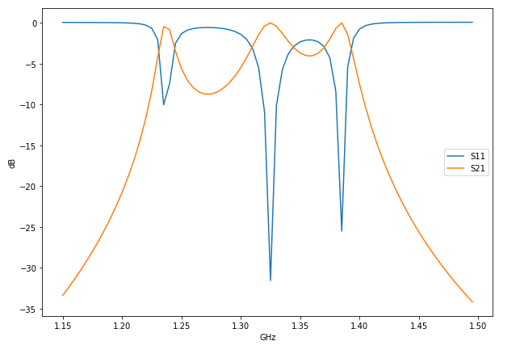
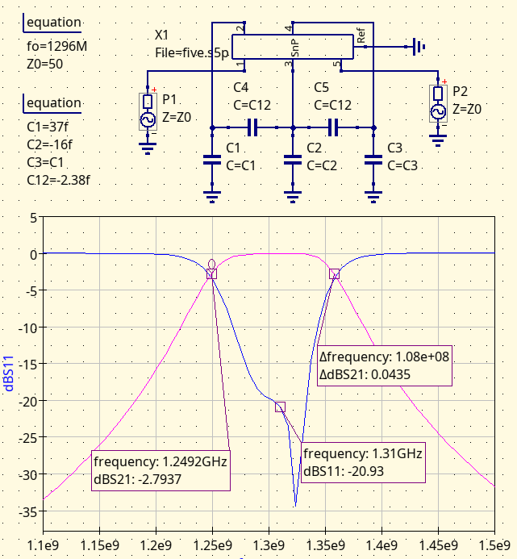
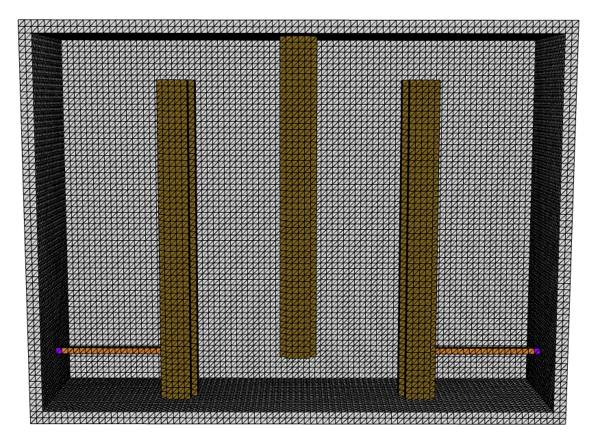
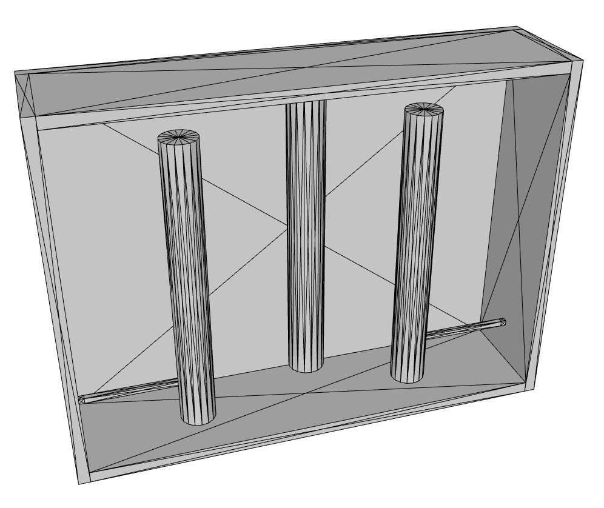
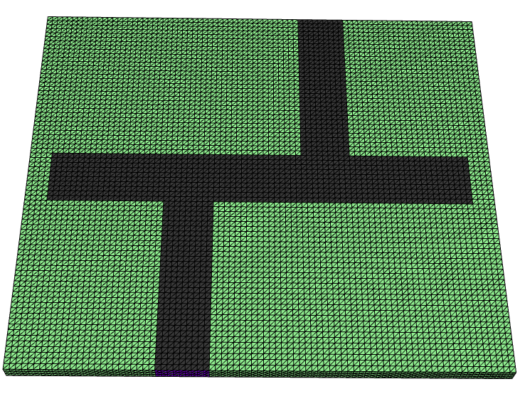

# Rffdtd 




## Overview

This repo provides a FDTD (Finite Difference Time Domain) simulator
called rffdtd for solving RF circuits.  Rffdtd outputs its simulation 
results as s-parameters in the touchstone file format.  It can also run its simulations
on one or more GPUs.  Other open source FDTD projects either do not support, or
if they do, cannot generate s-parameters using a GPU.  

The simulator is written in Python and requires the libraries numpy and
pytorch in order to execute.

The geometry and material information
needed to run a FDTD simulation are provided through OFF geometry files.  The
contents of the OFF file constitute the physical structure of the model
while the name of the OFF file identifies
the material the geometry represents.  These OFF files can be zipped
up into a ZIP file for your convenience.

Rffdtd places your model inside a PEC cage, thereby surrounding the model within a PEC boundary.  The software does not
support any type of absorbing boundaries, such as PMLs.  The
simulator was constructed as a tool to help design devices
such as filters or other circuits that will be placed inside an
enclosure, not for antennas necessarily or solving "scattering" problems like
radar or MRI.

## Examples

To simulate the microstrip lowpass filter example included [1], run the following below.
The simulator will use the OFF files in the ZIP file to construct the lowpass filter.
The --df option sets the frequency step you want the s-parameter results to provide.  The
--pitch option sets the length of a side of a FDTD grid cell in millimeters to use.
The --stop option tells rffdtd which port it should excite last.


```
$ rffdtd --df 5e9 --stop 1 --pitch .264 examples/lowpass.zip
Microstrip Lowpass Filter.
The Finite-Differnce Time-Domain Method for Electromagnetics with 
MATLAB Simulations, Elsherbeni and Demir.  Section 6.2.
Reproduced from Application of the Three-Dimensional Finite-Difference
Time-Domain Method to the Analysis of Planar Microstrip Circuits,
David Sheen, Sami Ali, IEEE MTT Vol 38, No 7, July 1990, p.849.
Grid is 27.456 x 24.552 x 9.504 mm in size and composed of 348192 cells.
Each individual simulation needs about 17.939 MiB of memory.
Running 1 simulation(s) on device cuda.
Using GPU: NVIDIA GeForce RTX 3070 Ti
 393 / 393 / 1   
FDTD simulation time: 0 min 3.56 sec
# MHZ S RI R 50
5004.77840409784      0.206647     0.235451     -0.301889     0.193343             0            0             0            0
10009.5568081957     -0.191668    -0.420107      0.251429    -0.190049             0            0             0            0
15014.3352122935     0.0577089     0.620481     -0.177324     0.204689             0            0             0            0
20019.1136163913    -0.0736987    -0.476186     0.0937505    -0.200935             0            0             0            0
25023.8920204892     0.0579163     0.547018    -0.0150803     0.168086             0            0             0            0
30028.670424587       -0.12917    -0.144554    -0.0450817    -0.111771             0            0             0            0
35033.4488286848      0.233614     0.197099     0.0766819    0.0427396             0            0             0            0
40038.2272327827     -0.148848     0.272768    -0.0781926    0.0215515             0            0             0            0
45043.0056368805      0.200928    -0.196686     0.0573403   -0.0651319             0            0             0            0
```


To simulate a 1296 MHz interdigital filter [2], run:


```
$ rffdtd --df 5e9 --pitch 1 examples/fisher.zip
1296 MHz Interdigital 3-Pole Butterworth Filter, 110 MHz BW
Grid is 94 x 28 x 68 mm in size and composed of 178976 cells.
Each individual simulation needs about 10.764 MiB of memory.
Running 5 simulation(s) on device cuda.
Using GPU: NVIDIA GeForce RTX 3070 Ti
 260 / 260 / 5   
FDTD simulation time: 0 min 3.65 sec
# MHZ S RI R 50
1997.13757300753      0.720564     0.133363      0.319366    0.0324427   -4.7234e-05 -0.000341566  -5.98713e-07 -0.000130884    0.00135092  -0.00533538
                      0.319075    0.0276699      0.244195    0.0409174    -0.0317367    0.0152482   4.98366e-05  0.000121818   2.40757e-07  0.000126525
                  -4.53037e-05 -0.000327706    -0.0317819    0.0153024      0.283138     0.190103    -0.0317819    0.0153024   4.53033e-05  0.000327707
                  -2.40754e-07 -0.000126525   4.98366e-05  0.000121818    -0.0317367    0.0152482      0.244195    0.0409174     -0.319075   -0.0276699
                    0.00135092  -0.00533538   5.98706e-07  0.000130884   4.72342e-05  0.000341565     -0.319366   -0.0324427      0.720564     0.133363
3994.27514601507      0.878776   0.00974387      -0.11885    -0.236205   0.000138449  0.000288372  -6.75998e-06  8.78498e-05   -0.00150386   0.00277192
                     -0.116031    -0.234279      0.257189    0.0828258     0.0214704    0.0109032  -4.24485e-05 -0.000118649   7.87312e-06 -8.52005e-05
                   0.000135004  0.000282619     0.0215331    0.0109157      0.432587     0.240882     0.0215331    0.0109157  -0.000135004 -0.000282619
                  -7.87313e-06  8.52005e-05  -4.24485e-05 -0.000118649     0.0214704    0.0109032      0.257189    0.0828258      0.116031     0.234279
                   -0.00150386   0.00277192   6.75999e-06 -8.78498e-05  -0.000138449 -0.000288371       0.11885     0.236205      0.878776   0.00974387
5991.4127190226       0.619553    -0.636014    -0.0716471     0.230911  -2.74443e-05 -0.000542583   2.13501e-05 -8.49013e-05    0.00177238  -0.00198939
                     -0.074737     0.229364       0.27978    0.0919516   -0.00778988   -0.0208703   5.92708e-05  7.05543e-05  -2.25764e-05  8.31597e-05
                  -1.91006e-05  -0.00054794   -0.00781808   -0.0209552      0.555016     0.247071   -0.00781808   -0.0209552   1.91003e-05   0.00054794
                   2.25764e-05 -8.31597e-05   5.92708e-05  7.05543e-05   -0.00778988   -0.0208703       0.27978    0.0919516      0.074737    -0.229364
                    0.00177238  -0.00198939  -2.13501e-05  8.49013e-05   2.74445e-05  0.000542583     0.0716472    -0.230911      0.619553    -0.636014
7988.55029203013    -0.0325255     -0.15468      0.176886    -0.140264  -0.000540901  0.000597956  -4.69702e-05  9.34853e-05   -0.00220724   0.00161413
                      0.177863    -0.136669      0.240361    0.0567644   -0.00576343    0.0220807  -0.000290361 -0.000268167   4.76668e-05  -9.0912e-05
                  -0.000567673   0.00059795    -0.0058604    0.0222421      0.653972    0.0994531    -0.0058604    0.0222421   0.000567673  -0.00059795
                  -4.76668e-05   9.0912e-05  -0.000290361 -0.000268167   -0.00576343    0.0220807      0.240361    0.0567644     -0.177863     0.136669
                   -0.00220724   0.00161413   4.69702e-05 -9.34853e-05   0.000540901 -0.000597956     -0.176886     0.140264    -0.0325255     -0.15468
9985.68786503767      0.529665    0.0904543     -0.217029    0.0546029   0.000973539  0.000172875   9.24784e-05 -0.000107945    0.00302403  -0.00133727
                     -0.216861    0.0471337     0.0661122     0.182512     0.0170363   -0.0182163  -3.46436e-05   0.00111847  -9.38375e-05  0.000102664
                    0.00101338   0.00021961     0.0172853   -0.0184107      0.445226    0.0538577     0.0172853   -0.0184107   -0.00101338  -0.00021961
                   9.38375e-05 -0.000102665  -3.46437e-05   0.00111847     0.0170363   -0.0182163     0.0661122     0.182512      0.216861   -0.0471337
                    0.00302403  -0.00133728  -9.24784e-05  0.000107945  -0.000973538 -0.000172876      0.217029   -0.0546029      0.529665    0.0904543
11982.8254380452      0.351489    -0.211334      0.254712   0.00150556  -2.18897e-05  -0.00105785  -0.000174284  0.000127086   -0.00453551    0.0010798
                      0.254106    0.0133217      0.270145     0.493838    -0.0262636    0.0135235    0.00199752  -0.00129799   0.000176775 -0.000117568
                  -1.93278e-05  -0.00115942    -0.0266533    0.0135698      0.616811     0.336067    -0.0266533    0.0135698    1.9328e-05   0.00115942
                  -0.000176775  0.000117568    0.00199752  -0.00129799    -0.0262636    0.0135235      0.270145     0.493838     -0.254106   -0.0133217
                   -0.00453551    0.0010798   0.000174284 -0.000127086   2.18883e-05   0.00105785     -0.254712  -0.00150559      0.351489    -0.211334
```


Also see the examples.ipynb Jupyter notebook in the repo for plots and more.

## Usage


```
$ rffdtd --help
usage: rffdtd [-h] [--output OUTPUT] [--export EXPORT] [--start START] [--stop STOP]
                   [--pitch PITCH] [--df DF] [--steps STEPS] [--ntau NTAU] [--ndelay NDELAY]
                   [--zo ZO] [--ngpu NGPU] [--dtype DTYPE] [--device DEVICE] [--symmetric]
                   filename [filename ...]

positional arguments:
  filename         OFF geometry file comprising the FDTD simulation, ZIP files accepted

optional arguments:
  -h, --help       show this help message and exit
  --output OUTPUT  save the s-parameter result to the given file. Files ending with .npz will
                   be saved as .npz files, otherwise they will be saved as touchstone files.
                   The default is to send the output to the console. (default: None)
  --export EXPORT  save voxelization as an OBJ file, no simulation (default: None)
  --start START    first port to excite, starting from 1 (default: None)
  --stop STOP      last port to excite, starting from 1 (default: None)
  --pitch PITCH    length of a side of a uniform cell in mm (default: 1.0)
  --df DF          frequency step in Hz to resolve, sets simulation steps (default: None)
  --steps STEPS    explicitly set number of simulation steps (default: None)
  --ntau NTAU      pulse width of excitation in units of simulation steps (default: 20)
  --ndelay NDELAY  time delay of excitation in units of pulse widths (default: 6.5)
  --zo ZO          line impedance of ports in ohms (default: 50)
  --ngpu NGPU      number of GPUs to use, or all by default (default: None)
  --dtype DTYPE    "float" or "double" data type (default: float)
  --device DEVICE  "cuda" or "cpu" compute device, otherwise will autodetect (default: None)
  --symmetric      make s-parameter matrices symmetric (default: False)
```


## Materials

To identify your OFF geometry as being made out of a particular material,
give the OFF file the same name as the material.  For example, if the
material is made out of silver, name it silver.off.  Rffdtd supports the following
material names: pec, silver, copper, gold, aluminum, brass, steel,
and air.  Any material it does not know, rffdtd will consider it a
PEC (Perfect Electrical Conductor).  If you have several OFF geometries
made out of the same materal, you can prefix the material name with a group 
name and then a dash.

For example the interdigital filter uses the following OFF files and file names:


```
$ unzip -l examples/fisher.zip
Archive:  examples/fisher.zip
1296 MHz Interdigital 3-Pole Butterworth Filter, 110 MHz BW
  Length      Date    Time    Name
---------  ---------- -----   ----
      492  1980-01-01 00:00   lid-aluminum.off
     1836  1980-01-01 00:00   box-aluminum.off
     5126  1980-01-01 00:00   rods1-aluminum.off
      123  1980-01-01 00:00   port2.off
     5072  1980-01-01 00:00   rods2-aluminum.off
      105  1980-01-01 00:00   port3.off
     5026  1980-01-01 00:00   rods3-aluminum.off
      118  1980-01-01 00:00   port4.off
      479  1980-01-01 00:00   tap1-copper.off
      479  1980-01-01 00:00   port1.off
      465  1980-01-01 00:00   tap2-copper.off
      465  1980-01-01 00:00   port5.off
---------                     -------
    19786                     12 files
```


To support other materials, for example PCB substrates with a certain permittivity, use
the following naming format for the material: er99.99e9.
For conductors, the naming convention, assuming a permittivity
of 1, is: sigma99.99e9.

To define both permittivity and conductivity the naming format is 
er99.99e9_99.99e9, the underscore separating the two.

## Lumped Ports

To create a port, use a material name of port99 starting
from port number 1.  The port will be a "lumped" port.  The opposite faces of the 
port should overlap a conductor.  A port can only be represented by a cube or 
a plane, but not a cylinder for example.

## Expanding The PEC Cage

The PEC cage, as mentioned above, will abutt the bounding box of your model with a padding 
of one cell.  To enlarge the bounding box use the air material.  The air material will be dropped and 
ignored when the model is voxelized.  However it will be considered when calculating
the model's bounding box.  See the lowpass and coupler examples.

## OFF Files

Provided in the example directory are scripts for generating
the OFF file simulation model examples.  The scripts use the python library
pycsg to generate these models.  To install pycsg run:

```
$ pip install pycsg
```

In addition there is a utility python library file, named csgsave.py, provided in the src
directory and zipped up in rffdtd.
The library contains code for saving the CSG solids pycsg creates as OFF files.
Of course, you can also use FreeCAD or OpenSCAD to generate your own OFF files
and simulation models as well.

## Voxelization

The simulator performs the voxelization using a "z-buffer" algorithm.
This algorithm has the advantage that it will fill mesh geometries.
Unfortunately it also has problems in that it might fill holes
that it should not.  This is especially so with hollowed cubes.
To rectify this, any geometry with holes needs to be broken up.
For example an interdigital filter inside a hollowed cube enclosure must
be broken into a box with a lid.  In addition this lid
needs to be placed in a separate OFF file than the box.  See the
provided interdigital filter for an example of this.

To inspect how well the model is voxelized, use the --export option.
This will output the voxel result as an OBJ file and skip the simulation.

```
$ rffdtd --pitch 1 --export examples/fisher_voxel.obj examples/fisher.zip
```

The export process fuses all similar material into one mesh.  So to create a cover
that can be hid in your CAD software, use a different material, but not very different,
for the cover.  See again the interdigital filter example.



Its original non-voxelized geometry is shown here.  This geometry
is from fisher.obj.  To generate this file as well as fisher.zip,
run python on fisher.py.



Planes can also be voxelized.  This is used to create microstrip models.
Rffdtd recognizes a geometry as a plane if the plane uses an entire OFF file for
itself and it has one dimension that is constant.  Also, only one rectangular
plane per OFF file is supported at the moment.  See the lowpass filter and
microwave coupler in the example directory. 



## Installation

To build rffdtd, run the following then copy the resulting executable rffdtd to whichever directory you want.

```
$ pip install numpy torch
OR
$ conda install -y -c pytorch pytorch
$ conda install -y numpy

$ sh build.sh
python res/zip.py -s 1 -o rffdtd src/* src/*/*
echo '#!/usr/bin/env python3' | cat - rffdtd.zip > rffdtd
rm rffdtd.zip
chmod 755 rffdtd
```

Or you can pip install it by entering the root directory of this repo and running:

```sh
$ pip install .
```

Besides installing the library named rffdtd it also installs the rffdtd 
command line script to your path.

## Python API

Import the library:

```python
import rffdtd
```

Run a simulation:

```python
freq, sparam = rffdtd.simulate(
    filename,       # file descriptor or name or as list of OFF or ZIP geometry files
    df=None,        # frequency step in Hz to resolve, sets simulation steps
    ds=.001,        # length of a side of a uniform cell in m
    ntau=20,        # pulse width of excitation in units of simulation steps
    ndelay=6.5,     # time delay of excitation in units of pulse widths
    zo=50,          # line impedance of ports in ohms
    dtype='float',  # "float" or "double" data type'
    device=None     # "cuda" or "cpu" compute device, otherwise will autodetect
    steps=None,     # explicitly set number of simulation steps
    start=None,     # first port to excite, starting from 1
    stop=None,      # last port to excite, starting from 1
    ngpu=None,      # number of GPUs to use, or all by default
    symmetric=False # make s-parameter matrices symmetric
    )
```

Where freq is a list of frequencies and sparam is a list of 
complex-number s-parameter matrices.  Each frequency in freq 
corresponds to its respective s-parameter matrix in sparam.
The numpy array sparam has the shape (nfreq, m, n).
The maximum frequency returned in freq is determined by the 
length of the excitation pulse width.  The frequency step used
is determined by the number of simulation steps.  The minimum number of
allowable steps is set to 2 * ntau * ndelay.

To read s-parameters from a string in touchstone format, or to
return s-parameters as a string using the touchstone format, 
use:

```python
f, s = rffdtd.read_touchstone(
    text            # load a touchstone file which is residing in a string
)
text = rffdtd.write_touchstone(  # return a touchstone file as a string
    f,              # list of frequencies corresponding to each s-parameter matrix
    s,              # list of s-parameter matrices
    zo=None,        # line impedance of ports in ohms (default 50)
    dtype=None,     # type of formatting, whether 'RI', 'MA' or 'DB' (default 'RI')
    precision=None  # number of signficant digits to output (default 6)
)
```

To load s-parameters from a text file in the touchstone format or from a .npz file; or to write s-parameters to a text file using touchstone format or a .npz file, use:


```python
f, s = rffdtd.load_touchstone(
    filename        # name of text file or .npz file to load
)
rffdtd.save_touchstone(  # save to a touchstone file
    f,              # list of frequencies corresponding to each s-parameter matrix
    s,              # list of s-parameter matrices
    zo=None,        # line impedance of ports in ohms (default 50)
    dtype=None,     # type of formatting, whether 'RI', 'MA' or 'DB' (default 'RI')
    precision=None, # number of signficant digits to output (default 6)
    filename=None   # name of text file (by default console) or .nzp file to write s-sparameters to
)
```

## S-Parameter Output In .npz files

If s-sparameters are saved to a .npz file, the frequencies, 
s-parameters, and normalized impedance are stored
as the attributes 'f', 's', and 'z' respectively.

## util/snpsum.py

The script snpsum.py in the util directory sums up the sparameters matrices 
for each frequency across all the touchstone files passed on the 
command line.  It then outputs the result to the console.

snpsum.py should be useful when running
a batch of simulations (each exciting a different set of
ports) on multiple machines against the same model.
All the touchstone file results can then be pulled together onto one machine
and summed up into one aggregated touchstone file using this utility.


## Notes

Pytorch does not support the M1 GPU yet.  I could not 
use tensorflow, which does support the M1 GPU, because my code requires a mutable
tensor which tensorflow does not provide.

Also I have issues with pytorch over reserving space on the GPU.
Unfortunately I have not resolved the issue.  I cannot find any
memory leaks in the code.

## Footnotes

[1] The Finite-Differnce Time-Domain Method for Electromagnetics with 
MATLAB Simulations, Elsherbeni and Demir.  Section 6.2 contains two
of the examples provided here: a lowpass filter and a microwave coupler.
The examples are from Application of the Three-Dimensional Finite-Difference
Time-Domain Method to the Analysis of Planar Microstrip Circuits,
David Sheen, Sami Ali, IEEE MTT Vol 38, No 7, July 1990, p.849.

[2] Interdigital Bandpass Filters for Amateur V.H.F/U.H.F. Applications,
High-Q Filter Construction Made Easy, Reed Fisher, March 1968 QST;
reproduced in the ARRL Handbook 2017, p11.32, figure 11.63.


